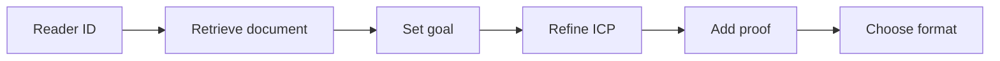

# Reader → Content Workflow

## Workflow



### Goal
- Choose: attract, nurture, or convert
- Ask: What am I trying to make happen with this?

### ICP refinement
- What problem am I solving?
- What’s the takeaway for them?
- What change or result could they get?
- What might they be wondering right now?

### Proof (build trust)
- Your experiences (behind the scenes, lessons learned)
- Client results (before/after, testimonials, screenshots)
- Real stories (observations, industry examples)
- External sources (only when they add weight)

### Format options
- Attract (awareness/trust): belief shift, origin story, industry myths
- Nurture (authority/demand): framework, step-by-step, how I / how to
- Convert (qualify/filter): objection post, result breakdown, client success story

## Usage

```bash
python readwise_processor.py --document-id "<reader_document_id>" --task summarize
```

Tasks: summarize, extract-key-points, analyze-sentiment.

Configure token via `READWISE_TOKEN` or `config/settings.py`.